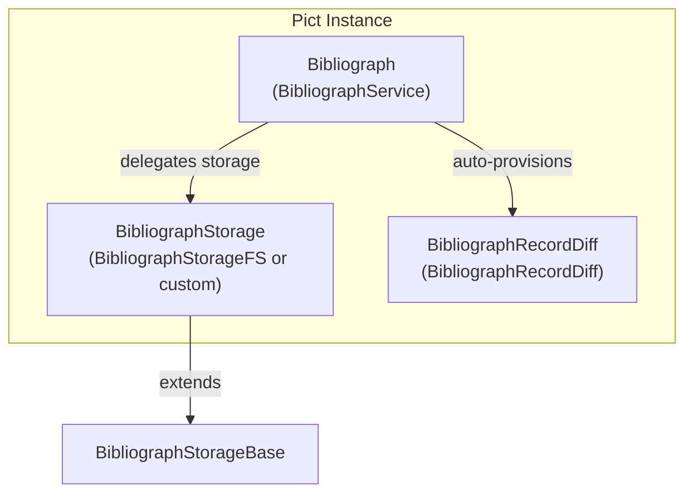
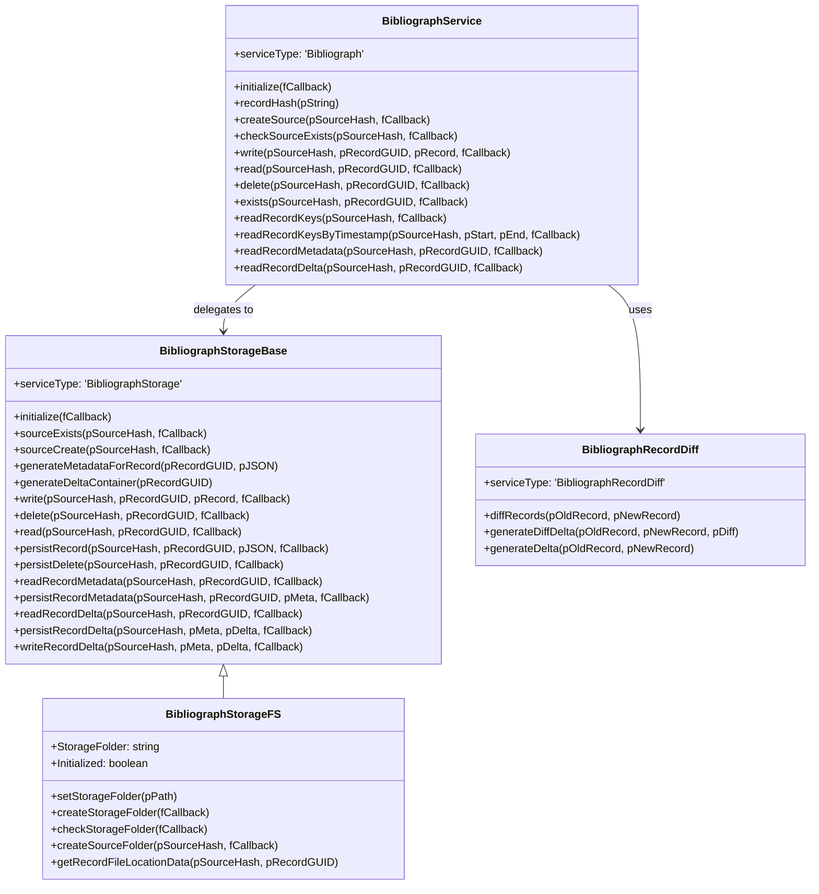
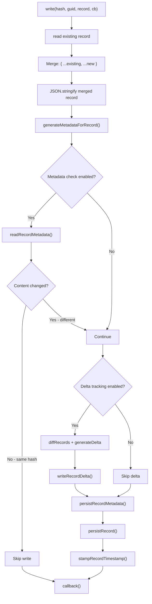
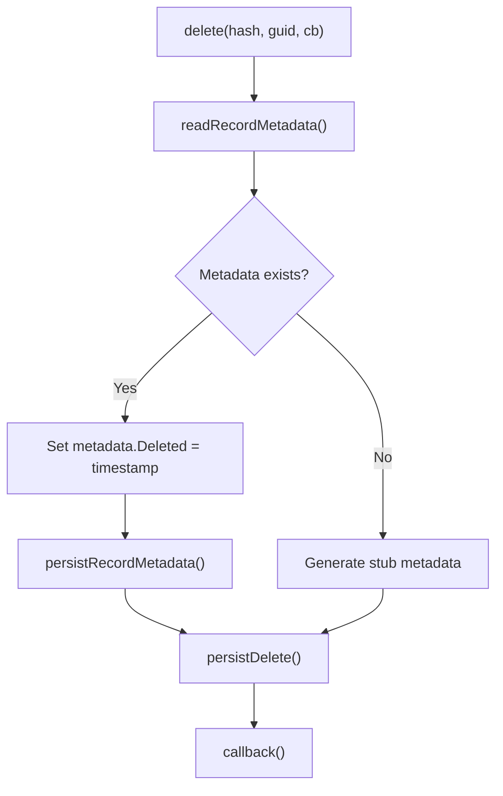
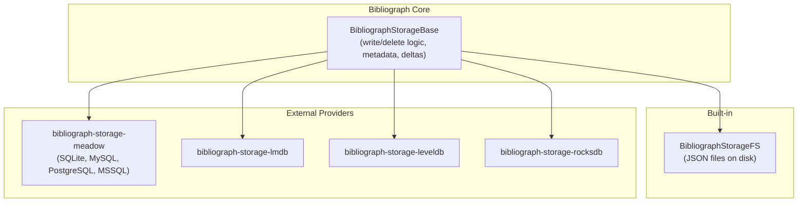
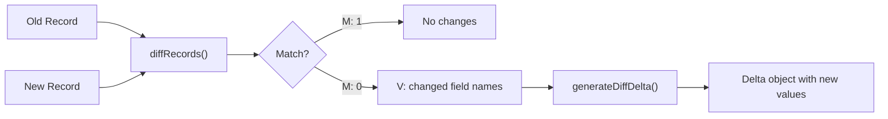
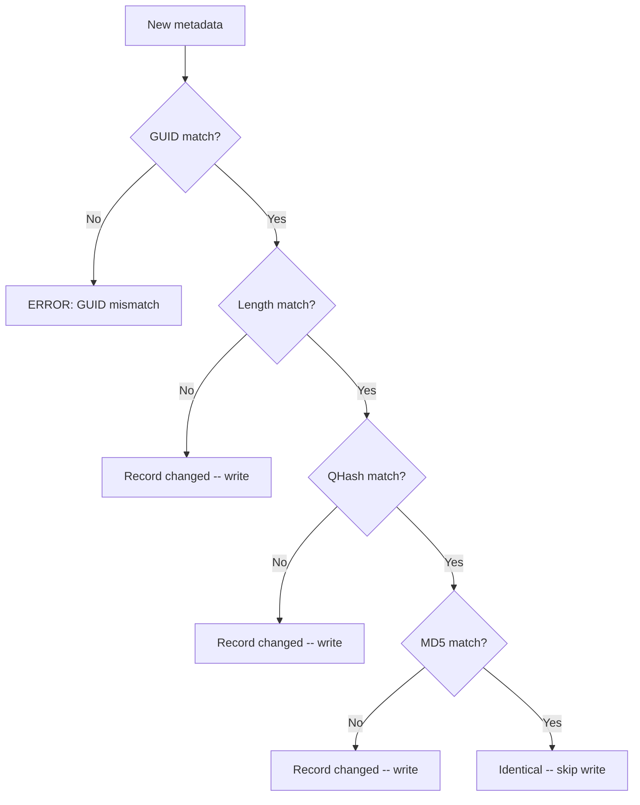

# Architecture

Bibliograph is structured as a set of Pict services organized into three layers: the main service facade, a pluggable storage provider, and supporting services for record comparison and format conversion.

## Service Hierarchy



All three services are registered on the Pict instance and are accessible as `_Pict.Bibliograph`, `_Pict.BibliographStorage`, and `_Pict.BibliographRecordDiff`.

## Class Hierarchy



## BibliographService

The main service class (`source/Bibliograph.js`) extends `ServiceProviderBase`. It acts as the public API and delegates all storage operations to the storage provider.

Responsibilities:

- Input validation (source hashes and record GUIDs must be non-empty strings)
- MD5 hash generation via `recordHash()`
- Automatic provisioning of the storage provider and diff service on construction

When instantiated, it checks whether `BibliographStorage` and `BibliographRecordDiff` services already exist on the Pict instance. If not, it creates them automatically. This means you can swap in a custom storage provider before instantiating Bibliograph, and it will use yours instead.

## Write Flow

The write operation is the most complex flow in Bibliograph. It handles merging, deduplication, metadata, and delta tracking:



## Delete Flow



## Storage Provider

The storage layer uses a base class / concrete implementation pattern.

**BibliographStorageBase** (`source/providers/storage/Bibliograph-Storage-Base.js`) extends `pict-provider` and defines the full storage interface. Its default implementations return empty results -- it is designed to be extended.

**BibliographStorageFS** (`source/providers/storage/Bibliograph-Storage-FS.js`) is the built-in concrete implementation. It stores records as JSON files on the local file system.

The base class contains the core write logic:

1. Read the existing record (if any)
2. Merge the new partial record with the existing record
3. Generate metadata (GUID, Length, QHash, MD5, Ingest timestamp)
4. Compare new metadata with existing metadata
5. If content is unchanged, skip the write
6. If content changed, generate and store a delta
7. Persist the record, metadata, and update the timestamp

This logic lives in the base class so all storage providers share the same deduplication and delta behavior.

## Storage Provider Architecture



## File System Layout

The FS storage provider creates this folder structure:

```
<storage-folder>/
  <source-hash>/
    metadata/       _<GUID>_metadata.json
    record/         <GUID>.json
    history/        _<GUID>_deltas.json
```

Each source gets its own folder with three subfolders for the three types of data. Record files contain the raw JSON object. Metadata files contain hash and timestamp data. History files contain an array of delta entries.

## Record Diff Service

**BibliographRecordDiff** (`source/services/record/Bibliograph-Record-Diff.js`) compares two JSON record objects and identifies which fields differ.



The diff result uses a compressed format optimized for storage at scale:

```javascript
// Records match:
{ "M": 1, "V": [] }

// Records differ:
{ "M": 0, "V": ["Age", "Height"] }
```

- `M` -- Match flag. `1` means identical, `0` means modified.
- `V` -- Value array. Lists the field names that differ between old and new.

The `generateDelta()` method combines comparison and extraction, returning an object containing only the changed fields and their new values, or `false` if nothing changed.

## Metadata Structure

Every record write generates a metadata object:

```json
{
	"GUID": "rec-001",
	"Length": 42,
	"QHash": "HSH-1024085287",
	"MD5": "461d65fea865254459a3c57f2f554ccf",
	"Ingest": 1706900000000
}
```

- **GUID** -- The record identifier
- **Length** -- Character count of the serialized JSON
- **QHash** -- A fast insecure hash for quick comparison (CRC-like)
- **MD5** -- Full MD5 hash of the serialized JSON
- **Ingest** -- Millisecond timestamp of when the record was written

The deduplication check compares Length, then QHash, then MD5 -- stopping early when possible for performance.

## Deduplication Check Order



## Delta Container Structure

When delta tracking is enabled, changes are stored in a container:

```json
{
	"RecordGUID": "rec-001",
	"Deltas": [
		{
			"Delta": { "Age": 42 },
			"Ingest": 1706900050000
		},
		{
			"Delta": { "Age": 870 },
			"Ingest": 1706900100000
		}
	]
}
```

Each entry in the `Deltas` array contains only the fields that changed and the timestamp of the change.

## Async Pattern

All operations use Node.js-style callbacks (`function (pError, pResult)`). Sequencing of multiple async steps uses Pict's `Anticipate` pattern, which queues callbacks and runs them in order.

```javascript
let tmpAnticipate = _Pict.newAnticipate();

tmpAnticipate.anticipate(function (fNext) { /* step 1 */ fNext(); });
tmpAnticipate.anticipate(function (fNext) { /* step 2 */ fNext(); });

tmpAnticipate.wait(function (pError) { /* all done */ });
```
